# Domain

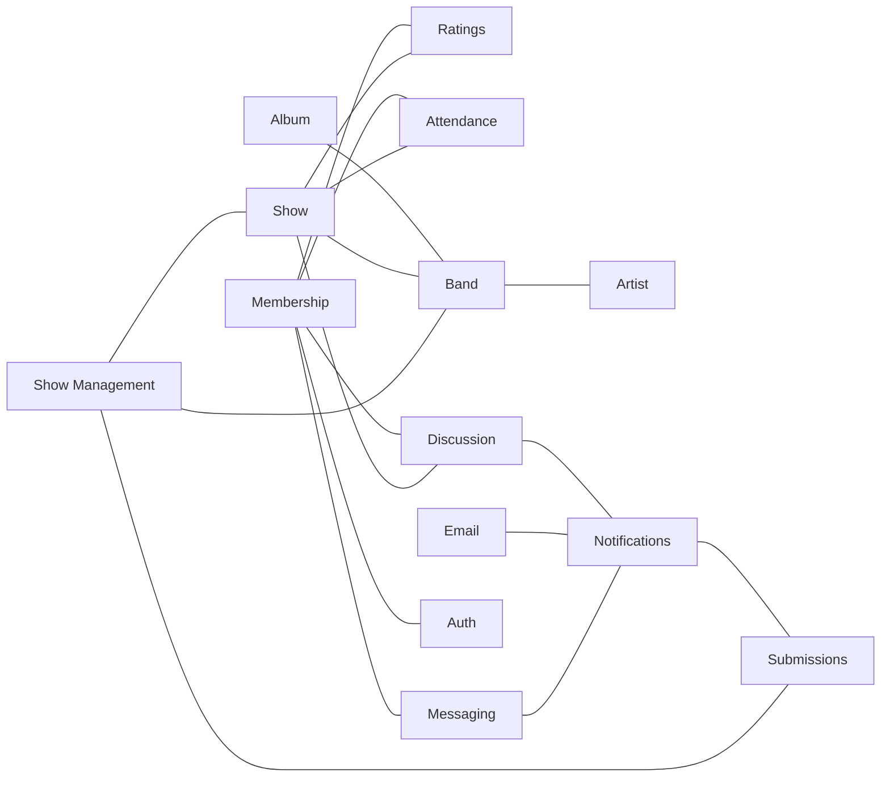

### Show Management

- Members can create and edit shows
- Can see a full history of changes to shows

### Membership

- Can manage Member aspects like name, avatar, roles, etc.
- Add and remove moderators
- Manage email notification settings

### Discussion

- Members can comment on shows
- Members can vote on comments
- Members can flag inappropriate comments
- Moderators can remove comments

### Ratings

- Members can rate shows

### Attendance

- Members can mark attendance for shows

### Submissions

- Members can submit new shows or edits to existing shows
- Submissions are reviewed by moderators
- Moderators can approve or reject submissions
- Moderators and members can comment on submissions

### Notifications

- Members can receive notifications for submissions changes such as approved submissions, rejected submissions, and comments on submissions
- Member can receive notifications when a moderator sends them a message

### Email

- Sends emails for notifications

### Messaging

- Members can send messages to moderators

### Band

- Moderators can add and edit band names and performers

### Artist

- Moderators can add and edit artist names

### Album

- Moderators can add and edit albums

# Bounded Contexts

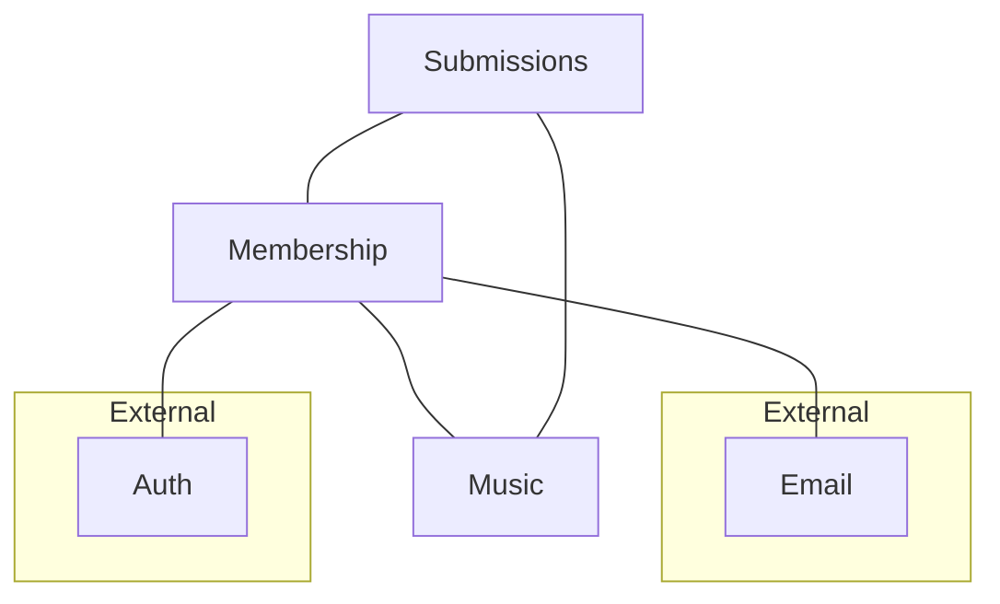

## Music

- Shows
- Bands
- Artists
- Albums

## Membership

## Submissions

## Auth

## Email

<!-- ```mermaid
flowchart LR

  subgraph membership[Membership]
    Membership
    Messaging
    Notifications
  end

  subgraph show[Show]
    ShowManagement[Show Management]
    Bands
    Ratings
    Attendance
    Discussion
  end

  Notifications

  subgraph email[External]
    Email
  end

  subgraph auth[External]
    Auth
  end

  Membership --- Auth
  Membership --- ShowManagement
  Membership --- Ratings
  Membership --- Attendance
  Membership --- Discussion
  Membership --- Messaging
  Membership --- Notifications
  Notifications --- Email
  ShowManagement --- Bands
  ShowManagement --- Discussion
  ShowManagement --- Notifications

``` -->

# Aggregates

## Membership Bounded Context

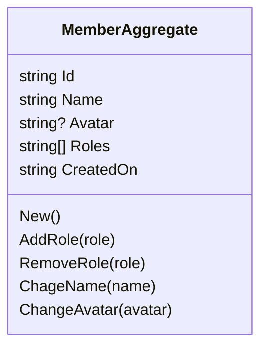

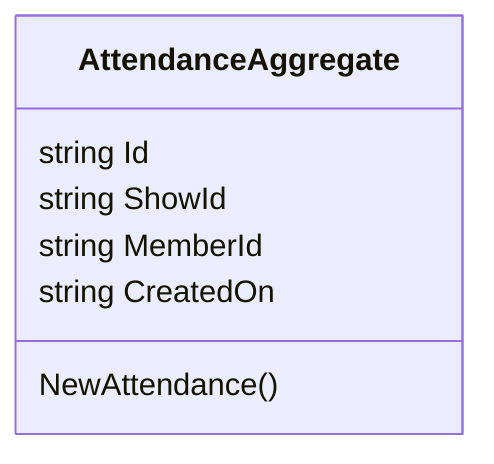

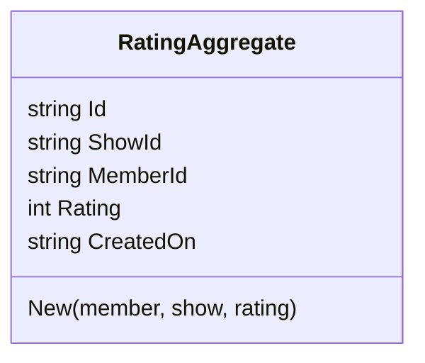

## Music Bounded Context

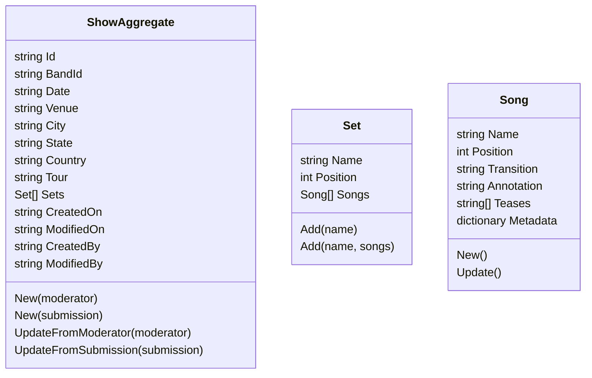

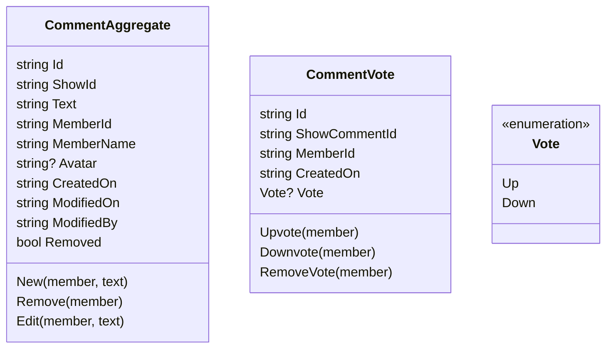

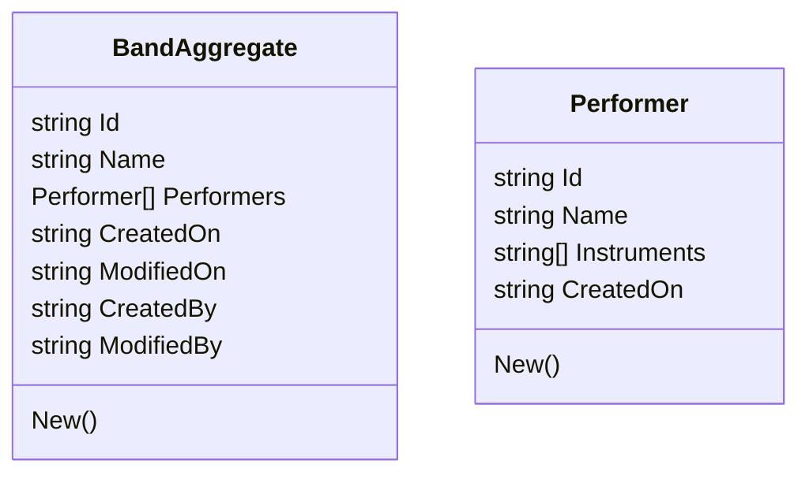

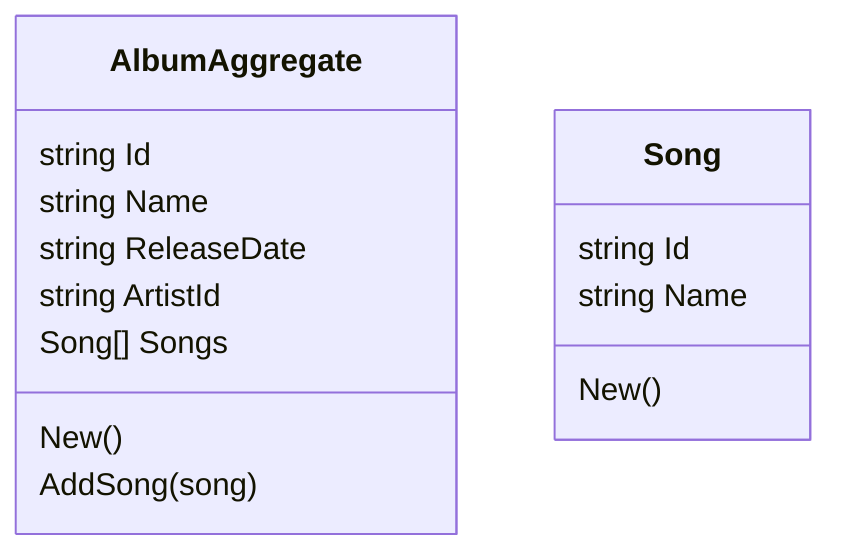

## Submissions Bounded Context

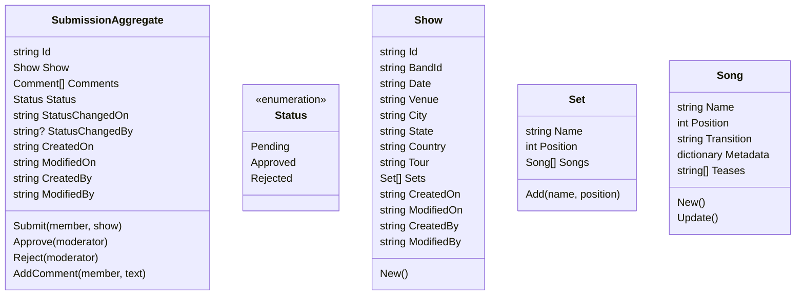

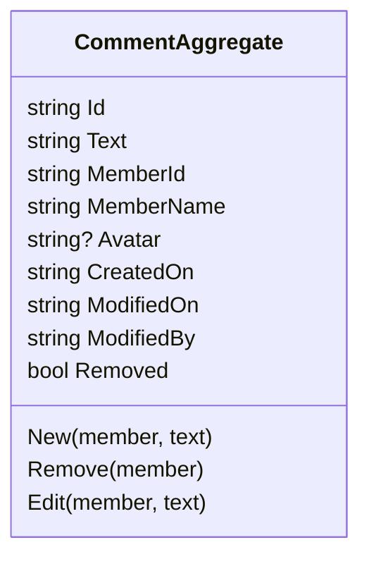

# Projections

- Show with ratings, attendance, and comments
- Shows by rating
- Shows by band
- All songs
- Shows by song
- All venues
- Shows by venue
- All cities
- Shows by city
- All countries
- Shows by country
- All states
- Shows by state
- All tours
- Shows by tour
- Shows by date (month and day: "On this date...")
- Attendance by member
- Ratings by member
